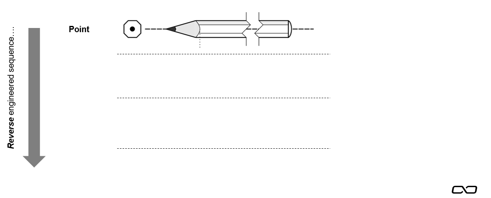
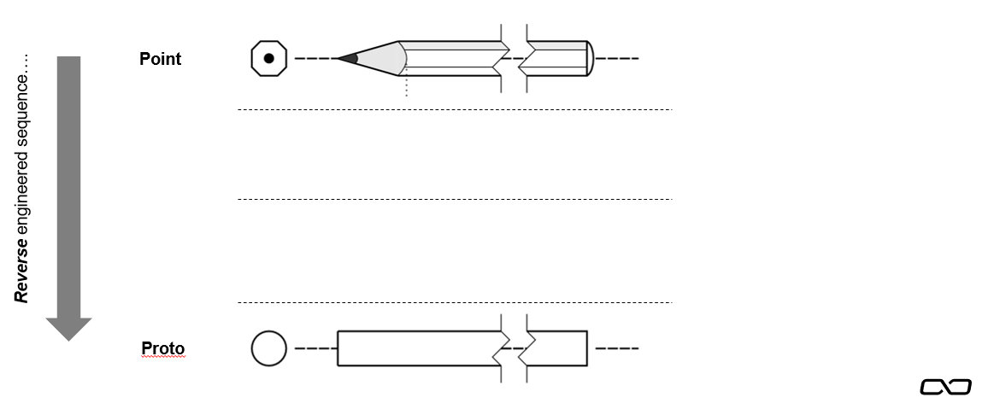
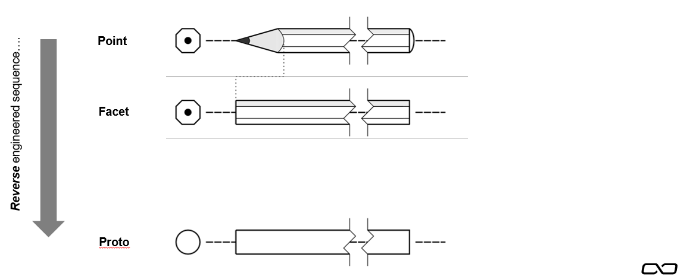
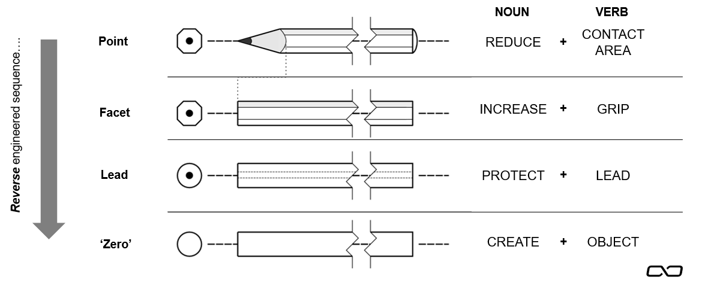

## M2 - Identify Stages

### 2.1 Identify Stages
Until now we have made observations about the physical pencil. The final design object. What biologists would call the 'phenotype'. It is the adult, fully grown organism. In the next steps you need to use a mixture of imagination and logic to determine the 'growth stages' of the artfact / system. The idea for these stages is that they 'expand the design space' of the artefact or system. Having annotated / listed the features for each segment. To prepare for the next step, draw empty rows below your phenotype. Add the final stage (the 'real' pencil / artefact / system) to the top row if you have not done so already. Next you need to identify the 'order' that these features conceptually express in the these features would 

#### 2.2 Identify the Proto Stage
This is the conceptual platonic (zero) or proto start for your object or system. If it has a clear symmetry it is probably a tube rotated around the axis, but it could also be a plane a cube or a sphere. The first stage might have little functional, geometric or material proximity to the phenotype. But it could define some essential condition such as inside / noutside or above ground / below ground.

#### 2.3 Find feature A
Identify the first feature of the phenotype that you think should be included in the growth process. This first feature should be placed in between the start (proto) stage and the phenotype. At this satge itr does not matter where you draw it and you may need to move it so draw clearly but fast (not precious).

#### 2.4 Find feature B (Repeat until complete)
Consider if the design was 'growing', at would stage would feature B 'express' itself? would it be before or after the feature A? Repeat steps 2.3 and 2.4 (this one) until you have arranged all the features you have found for the system / artefact into a sequence. Congratulation you can now define the conceptual growth stages of your system!

* Check the that you have included the segments for each stage and that it is clear to see how the segments subdivide through the stages.
* Are there different types of stages?
* Have you left any 'gap' stages that will be filled by other systems?
* Check the Phenotype stage is at the top of the drawing.

#### 2.5 Identify the functions
For each of the stages, identify the function that the feature is performing. You can start by writing this as a sentence and then write it verb, noun form as in the image below.

